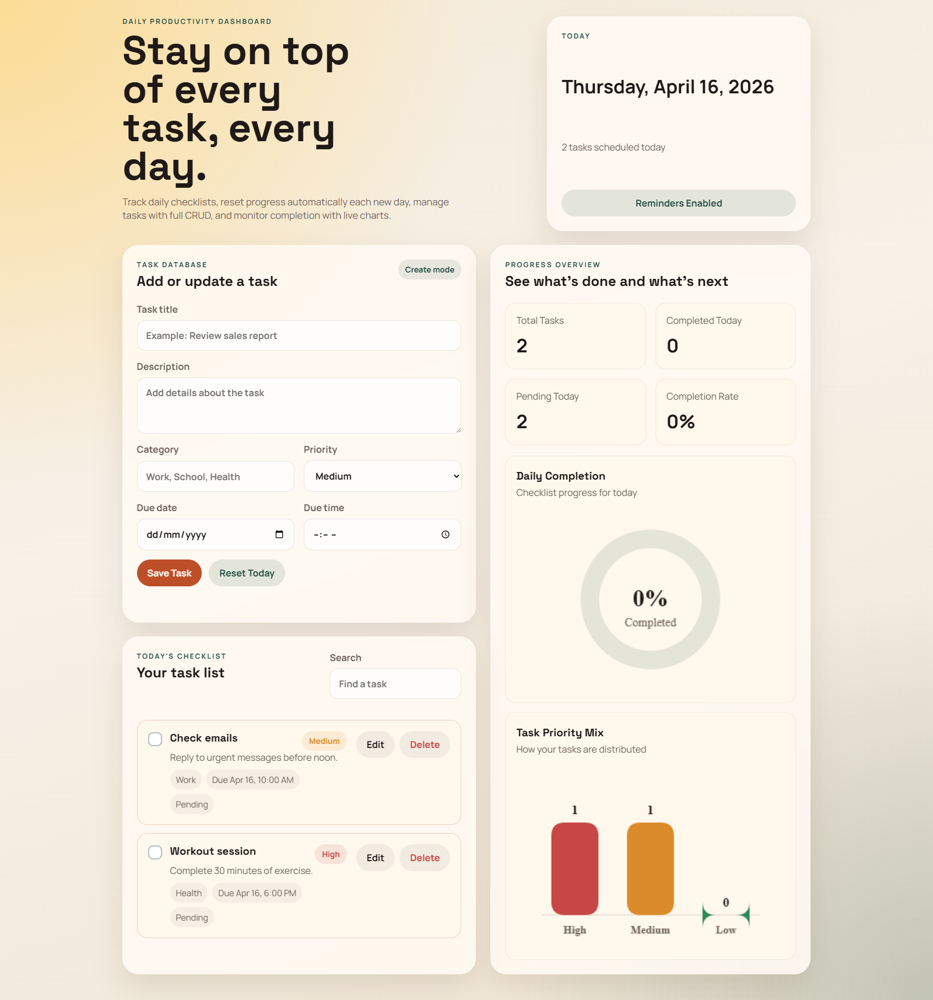
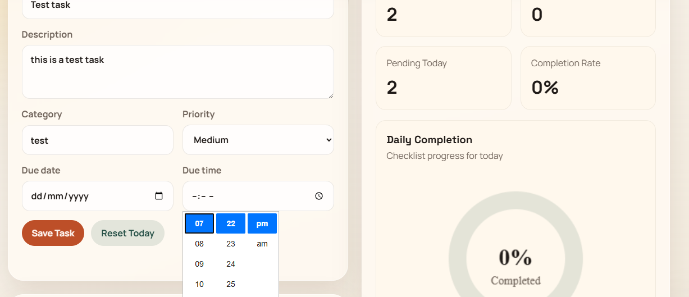
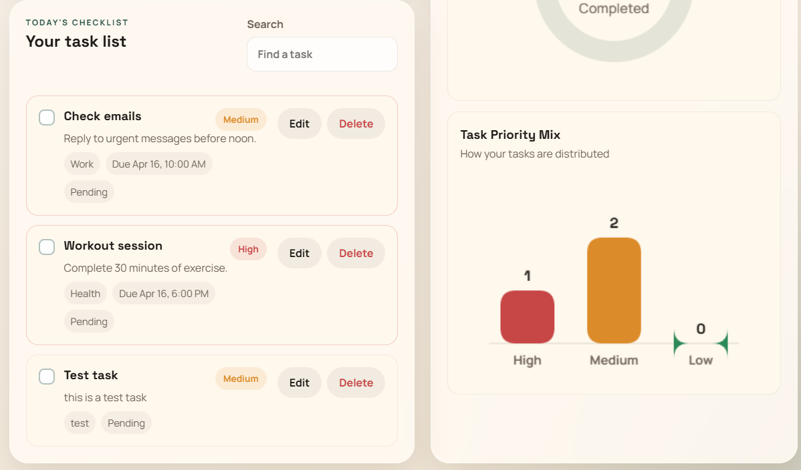

# 📋 Daily Task Maker

A clean, simple, and responsive daily task manager web application designed to help users organize and track their daily activities efficiently. This project showcases core front-end development skills, focusing on DOM manipulation and interactive UI design.

---

## 📸 Project Showcases

To provide a clear view of the application interface and functionality, here is a visual overview:

<p align="center">
  
  
  
</p>

> **Note to Educators & Students:** This repository serves as an open-source reference for beginners who want to learn JavaScript DOM manipulation, event handling, and basic UI design using HTML and CSS.

---

## 🚀 Key Features

* **Add Tasks:** Easily create and manage daily tasks.
* **Delete Tasks:** Remove completed or unnecessary tasks.
* **Real-Time Updates:** Instantly reflects changes in the UI.
* **User-Friendly Interface:** Simple and clean design for better usability.
* **Responsive Layout:** Works smoothly across desktop and mobile devices.

---

## 🛠️ Tech Stack

* **HTML5:** Provides structure and semantic layout.
* **CSS3:** Handles styling and responsive design.
* **JavaScript (ES6+):** Manages logic, interactivity, and DOM manipulation.

---

## 📂 Installation & Usage

1. Clone the repository:
   ```bash
   git clone https://github.com/YOUR_USERNAME/daily-task-maker.git
